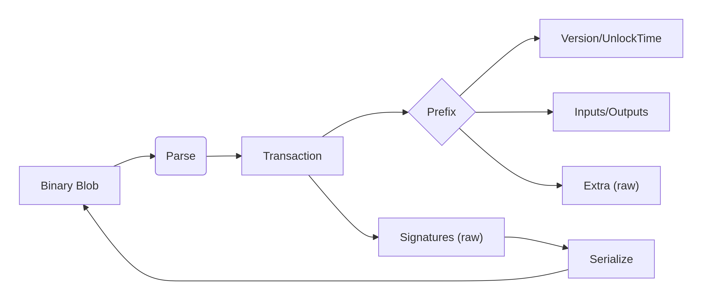

# go-monblob

<div align="center">
  
</div>

[](https://go.dev/)
[](LICENSE)
[](https://goreportcard.com/report/github.com/cexpepe/go-monblob)

**go-monblob** is a pure Go, zero-dependency library for parsing and serializing Monero transaction binary blobs (`tx_blob`). It follows [CNS003](https://cryptonote.org/cns/cns003.txt) and Monero v0.18+ specifications, adopting a strategy of “precise prefix parsing + raw signature retention” to support all transaction versions (V1/V2) and all RingCT types (0–5).

---

## Features

-  **Zero external dependencies** – only uses the Go standard library (with `golang.org/x/crypto/sha3` for Keccak-256, but that’s an official Go extension).
-  **Full parsing** – supports parsing and serialization of `Transaction` and its prefix (`TransactionPrefix`).
-  **Flexible storage** – signature blocks (including RingCT) are kept as raw bytes, enabling lossless round‑trips.
-  **High performance** – parses 100,000+ typical transactions (~2KB) per second on a single core.
-  **Production‑ready security** – built‑in recursion depth, slice size, and memory limits to prevent DoS attacks.
-  **Fuzz testing** – native Go fuzz tests to continuously verify robustness.

---

## Architecture Overview

The diagram below illustrates the parsing flow: from raw `[]byte` → `Transaction` struct, and the reverse serialization.

<div align="center">
  
</div>

---

## Installation

```bash
go get github.com/cexpepe/go-monblob
```

---

## Usage Example

```go
package main

import (
    "encoding/hex"
    "fmt"
    "log"

    "github.com/cexpepe/go-monblob"
)

func main() {
    // Hex blob obtained from RPC or file
    hexBlob := "020002020010c0b2d122f183e30386f332b1bc01..." // truncated

    data, err := hex.DecodeString(hexBlob)
    if err != nil {
        log.Fatal(err)
    }

    // Parse full transaction
    tx, err := monblob.Parse(data)
    if err != nil {
        log.Fatal(err)
    }

    fmt.Printf("Version: %d\n", tx.Prefix.Version)
    fmt.Printf("Inputs: %d\n", len(tx.Prefix.Inputs))
    fmt.Printf("Outputs: %d\n", len(tx.Prefix.Outputs))

    // Compute transaction ID (Keccak-256 of prefix)
    txid := tx.Hash()
    fmt.Printf("Transaction ID: %x\n", txid)

    // Parse only the prefix (lightweight inspection)
    prefix, _ := monblob.ParsePrefix(data)
    // ... use prefix

    // Serialize back to blob (lossless round-trip)
    reborn, _ := monblob.Serialize(tx)
    if len(reborn) == len(data) {
        fmt.Println("Round-trip successful")
    }
}
```

For more examples, see [blob_test.go](blob_test.go).

---

## API Reference

| Function | Description |
|----------|-------------|
| `Parse(data []byte) (*Transaction, error)` | Parses a full transaction from a binary blob |
| `Serialize(tx *Transaction) ([]byte, error)` | Serializes a transaction back to binary blob |
| `ParsePrefix(data []byte) (*TransactionPrefix, error)` | Parses only the transaction prefix (without signatures) |
| `SerializePrefix(prefix *TransactionPrefix) ([]byte, error)` | Serializes only the transaction prefix |
| `ParseFromReader(r io.Reader) (*Transaction, error)` | Stream‑based parsing |
| `SerializeToWriter(tx *Transaction, w io.Writer) error` | Stream‑based serialization |
| `tx.Hash() [32]byte` | Computes the transaction ID (Keccak‑256 of the prefix) |
| `HashPrefix(prefix *TransactionPrefix) [32]byte` | Computes the hash directly from a prefix |

---

## Testing

```bash
# Unit tests + vector tests (requires a real transaction in testdata/transaction.bin)
go test -v

# Fuzz testing (30 seconds)
go test -fuzz=FuzzParse -fuzztime=30s

# Benchmarks
go test -bench=. -benchmem
```

To prepare test data, place any Monero transaction binary as `testdata/transaction.bin` (you can export one using `monero-blockchain-export` or via the RPC `get_transactions` endpoint).

---

## Contributing

Issues and pull requests are welcome. Please ensure all tests pass and maintain the zero‑dependency principle.

---

## License

[MIT](LICENSE)

---

## Version v1.0.0

First stable release, supporting:
- V1/V2 transactions
- RingCT types 0–5 (signatures stored as raw bytes)
- Tagged outputs (v0.18+)
- Complete round‑trip serialization
